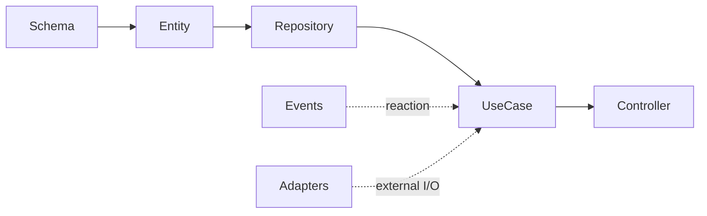

# Backend Engineering Standards

> **Purpose.** This skill defines **how the Turystack backend writes** what the
> constitution decides. `turystack-architecture-pattern` is a prerequisite: the
> law lives there, the mechanism lives here. The `@turystack/*` libraries are
> the source of truth for setup, options, decorators and public API.
>
> A law written in the constitution is **never rewritten here** — this skill
> cites the id (`ARC-n`, `LAY-n`, `CON-n`…) and shows the NestJS expression.

**Rules defined here:** none — every rule this file states is defined
elsewhere and cited by id.

## Where things live

There is one shape, so there is nothing to detect before writing code:

| | Lives in |
|---|---|
| A domain | `domains/<name>/src/` — one package, `@acme/<name>` |
| The error catalogue | `domains/<name>/src/support/<name>.exceptions.ts` — published by that domain |
| Persistence | `libs/database` — `@acme/database` |
| HTTP | `apps/<api>/src/controllers/<audience>/` |
| Events | a handler app, with `@Handler('EVENTBRIDGE')` or `@Handler('SQS')` |
| Schedule | a handler app, with `@Handler('SCHEDULE')` — the cron is the rule, not code |

Use-cases, entities and domain rules never move. Only the delivery point and the
dependency registration change, which is `ARC-TOP-2` restated in this stack.

## Mental model

- Schema is the source of truth for types.
- Entity protects business invariants.
- Repository composes persistence when the database's typed API is not enough.
- Use-case coordinates one operation.
- Controller/handler translates transport and delegates.
- Global libs are registered at the root and injected; never wrapped again.

## Validation ladder

The ladder comes from the constitution (`00-overview` › Validation ladder). Here
is where each rung lives in the backend, and the HTTP status the category
produces:

1. Input shape → route/handler schema (`400`).
2. Authentication and permission → guard (`401`/`403`).
3. Existence and ownership → use-case (`404`/`403`).
4. Business rule → entity (`409`).
5. Persistence and integration → repository/lib/adapter.

## Global invariants — they lived here, they live in the constitution

These ten laws moved up to `turystack-architecture-pattern`: none of them is
backend-specific, and keeping them in both places guaranteed divergence.

| Was | Now | Law |
|---|---|---|
| BE-1 | `ARC-LAY-1` | A lower layer never imports an upper layer. |
| BE-2 | `ARC-LAY-4` | Cross-domain through the other domain's public use-case, never through the repository. |
| BE-3 | `ARC-DEL-1` | The delivery boundary is thin: it translates, validates shape, delegates. |
| BE-4 | `ARC-LAY-8` | Infra covered by a lib is used directly; it never gets a local wrapper. |
| BE-5 | `ARC-LAY-8` | An integration without a lib sits behind an interface owned by the application. |
| BE-6 | `ARC-TOP-6` | Config validated at boot; no `process.env` in application code. |
| BE-7 | `ARC-CON-1` | Every write declares its consistency strategy. |
| BE-8 | `ARC-ERR-7` | An error is never silent; logged once at the boundary and rethrown. |
| BE-9 | `ARC-SEC-1` | Scope comes from the authenticated context, never from a client field. |
| BE-10 | `PRJ-L1` | `@turystack/backend-config` is the source of lint, format and TypeScript. Stack lint, so it stayed in this skill (`01-project-structure.md`) instead of moving to the constitution. |

This table is a migration aid, not law. It exists so a review or a commit
written before the move still resolves, and it retires with the next major —
by then nothing should be citing a `BE-n` id.

Read the constitution before this skill. What follows here is **how the
Turystack backend expresses** those laws — and the decisions that exist only in
the backend.

## Non-automated conventions

- Full, domain-oriented names; no generic abbreviations.
- Early return; shallow nesting; no `else` after `return`/`throw`.
- `unknown` + narrowing; never `any` or a cast to hide an incompatibility.
- Independent operations in `Promise.all`; dynamic batch with limited concurrency.
- Named exports; comments only when they record a constraint impossible to
  express in code.

## How to navigate

Read `01-project-structure.md` and then only the sections the task touches.
Setup and API details should be looked up in the documentation of the
corresponding library — `01-project-structure.md` › *Which library owns which
concern* maps each concern to its owner, and checking it before writing
infrastructure is what keeps `ARC-LAY-8` from being broken by accident.
